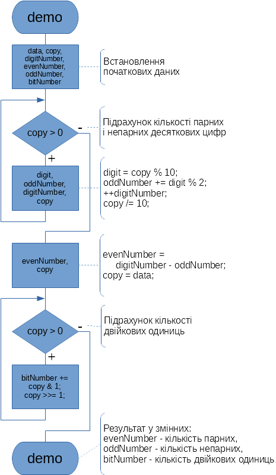
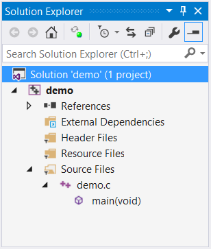
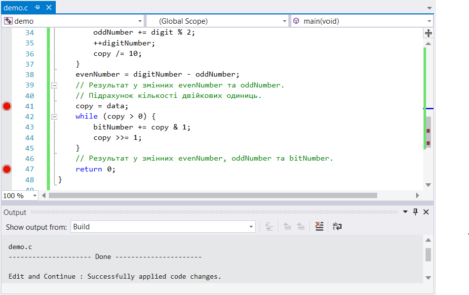
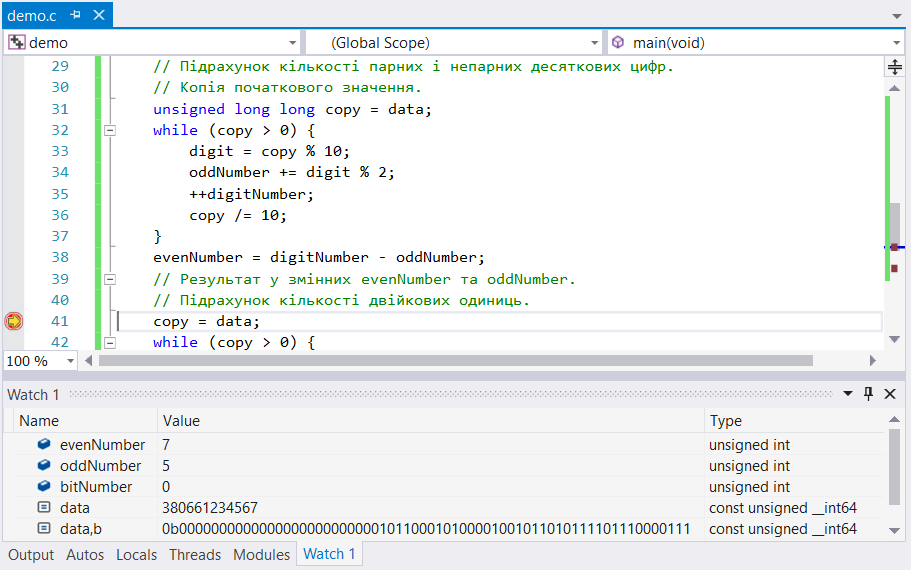
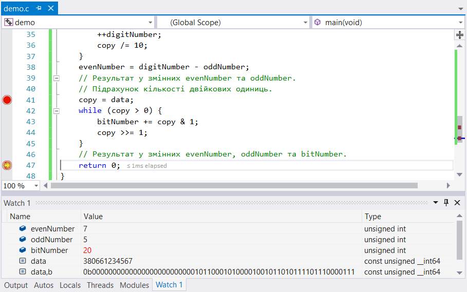

# 1. Ознайомлення з інтегрованим середовищем розробки програм мовою С

Мета: отримати навички розробки програм мовою С в інтегрованом середовищі Visual Studio.

## 1 ВИМОГИ

### 1.1 Розробник
Інформація про розробника:
- Молчанов Г.І;
- НТУ "ХПІ", кафедра "ОТП";
- демонстраційний варіант.

### 1.2 Загальне завдання
1) Розробити програму рішення прикладної задачі мовою С, використовуючи інтегроване середовище розробки Visual Studio.
2) Продемонструвати роботу програми в режимі відлагодження.
3) Забороняється використовувати засоби виведення до консолі.

### 1.3 Задача
1. Обрати тип змінної та встановити початкове значення, що відповідає номеру мобільного телефона (починаючи з 380...) за допомогою десяткового літералу.
2. Використовуючи десятковий запис цілочисельного значення змінної знайти і підрахувати кількість парних і непарних цифр.
3. Використовуючи двійковий запис цілочисельного значення змінної підрахувати кількість одиниць.

## 2 ОПИС ПРОГРАМИ

### 2.1 Функціональне призначення
Програма призначена для знаходження рішення прикладної задачи за допомогою арифметичних і логічних операцій, а також операцій зсуву. Результати зберігаються у відповідних змінних. Демонстрація знайдених результатів передбачає покрокове виконання програми в режимі налагодження.

### 2.2 Опис логічної структури
За допомогою операції визначення залишку від ділення "%" за правилами десяткової арифметики знаходимо десяткові цифри. Цілочисельне ділення "/" дозволяє виконати зсув значення на один десятковий розряд праворуч. Для підрахунку двійкових одиниць використовуємо операції зсуву праворуч ">>" та побітову логічну операцію "&".

Алгоритм програми наведено на рис.2.1.



Рисунок 2.1 - Схема алгоритму програми

Структура програми наведена на рис.2.2.



Рисунок 2.2 - Структура програми. Проект Visual Studio за назвою "demo"

### 2.3 Важливі фрагменти програми

Об'явлення та встановлення початкових значень змінних

```C
	// Початкові дані.
	// Номер мобільного телефону.
	const unsigned long long data = 380661234567;
	// Додаткові змінні.
	// Поточна цифра.
	unsigned int digit;
	// Кількість цифр.
	unsigned int digitNumber = 0;
	// Кількість парних.
	unsigned int evenNumber = 0;
	// Кількість непарних.
	unsigned int oddNumber = 0;
	// Кількість двійкових одиниць.
	unsigned int bitNumber = 0;

```

Підрахунок кількості парних і непарних десяткових цифр

```C
	// Копія початкового значення.
	unsigned long long copy = data;
	while (copy > 0) {
		digit = copy % 10;
		oddNumber += digit % 2;
		++digitNumber;
		copy /= 10;
	}
	evenNumber = digitNumber - oddNumber;
	// Результат у змінних evenNumber та oddNumber.
```

Підрахунок кількості двійкових одиниць

```C
	copy = data;
	while (copy > 0) {
		bitNumber += copy & 1;
		copy >>= 1;
	}
	// Результат у змінних evenNumber, oddNumber та bitNumber.
```

## 3 ВАРІАНТИ ВИКОРИСТАННЯ
Для демонстрації результатів використовується покрокове виконання програми та інші засоби налагодження в інтегрованому середовищі розробки Visual Studio.
Нижче наводиться послідовність дій запуску програми у режимі налагодження.

1) Установка точок зупину (див. рис.3.1).



Рисунок 3.1 - Точки зупину, що встановлені

2) Покрокове виконання та підрахунок кількості парних і непарних цифр (див. рис.3.2).



Рисунок 3.2 - Результат у змінних "evenNumber" та "oddNumber"

3) Покрокове виконання та підрахунок кількості одиниць. (див. рис.3.3).



Рисунок 3.3 - Результат у змінній "bitNumber"

## ВИСНОВКИ
В інтегрованому середовищі Visual Studio розроблена програма мовою С. Засоби відлагодження та покрокове виконання програми дозволяють продемонструвати коректність реалізованого алгоритму рішення прикладної задачі.